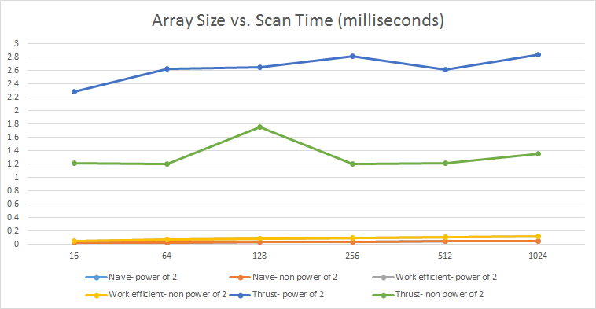

CUDA Stream Compaction
======================

**University of Pennsylvania, CIS 565: GPU Programming and Architecture, Project 2**

* Megan Moore
* Tested on: Windows 7, i7-4770 @ 3.40GHz 16GB (Moore 100 Lab C)

```

****************
** SCAN TESTS **
****************
    [   3  29  33  19   0  16  10  40  39  50  44  30   9 ...   4 -858993460 ]
==== cpu scan, power-of-two ====
    [   0   3  32  65  84  84 100 110 150 189 239 283 313 ... 6684 6688 ]
==== cpu scan, non-power-of-two ====
    [   0   3  32  65  84  84 100 110 150 189 239 283 313 ... 6613 6626 ]
    passed
==== naive scan, power-of-two ====
    passed
==== naive scan, non-power-of-two ====
    passed
==== work-efficient scan, power-of-two ====
    passed
==== work-efficient scan, non-power-of-two ====
    passed
==== thrust scan, power-of-two ====
    passed
==== thrust scan, non-power-of-two ====
    passed

*****************************
** STREAM COMPACTION TESTS **
*****************************
    [   4   3   0   3   4   2   3   2   3   1   1   1   4 ...   3 -858993460 ]
==== cpu compact without scan, power-of-two ====
    [   4   3   3   4   2   3   2   3   1   1   1   4   3 ...   3 -858993460 ]
    passed
==== cpu compact without scan, non-power-of-two ====
    [   4   3   3   4   2   3   2   3   1   1   1   4   3 ...   4   4 ]
    passed
==== cpu compact with scan ====
    [   4   3   3   4   2   3   2   3   1   1   1   4   3 ...   3 -858993460 ]
    passed
==== work-efficient compact, power-of-two ====
    passed
==== work-efficient compact, non-power-of-two ====
    passed
Press any key to continue . . .

```


### Questions

* Roughly optimize the block sizes of each of your implementations for minimal
  run time on your GPU.

  * Four different block sizes (128, 256, 512, 1024) were tested against four different array sizes (128, 256, 512, 1024).  Based on the cudaEvent timing, none of the different combinations led to a notable difference in times.  When the times did differ, it was only by a few tenths of a millisecond.  Also, the speed ups that occured with a blocksize for one of the scan functions, caused other scan functions to slow down.  Therefore, I used a consistent blocksize of 128 for all scan functions.  

* Compare all of these GPU Scan implementations (Naive, Work-Efficient, and
  Thrust) to the serial CPU version of Scan. Plot a graph of the comparison
  (with array size on the independent axis).
 
  * I tried to use the chrono implimentation to time the CPU scan function.  However, I continuously got 0 nanoseconds for each test.
  * The thrust application is taking a much longer time than all the other implimentations.  Seeing as the cudaEvent_t's, start and stop, occur right before and after the function call to thrust::exclusive_scan(), it could be possible that these events are picking up memory transfer timing.  Whereas, with all the other function, I was able to record the time without the memory transfer time being included.  One other interesting thing about the thrust application, is that the time for the non-power of 2 array is significantly lower than the time for the power of 2 array.  This, in theory, makes sense because a smaller array should take less time.  However, with all the other applications, they take approximately the same amount of time because the kernel is 2^(ilog2ceil(n)) times (for an array of size n).  This can be seen in the graph, as the naive/work-efficient power of 2 and non-power of 2 lines are almost identicle.  In the thrust application, they must be allocating their memory better, as they clearly do not have to call the kernel 2^(ilog2ceil(n)) times.  

* Write a brief explanation of the phenomena you see here.
  * It is interesting that the naive implementation is running faster than the work-efficient implementation.  This seems to go against what we think should be happening.  An idea of what could possibly be causing this is that the work-efficient implementation requires two function calls to kernels.  If the array is not so large, that it requires multiple blocks, then it could finish the naive scan implementation in the same time it finishes just one of the functions (up/down sweep) in the work-efficient scan implementation.  
  * I would guess that the bottlenecks are occuring at the memory transfers.  Especially in the work-efficient implementation, because it has so many different arrays (idata, odata, bools, and indices) it requires more memory allocation and transfers between the host and device.  I would not think the computation is a large part of the time, considering it is only addition, and the amount of addition that is necessary decreases throughout the function (in all of the implementations).  

